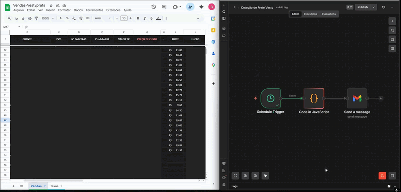

# Automação de Cotação de Frete de um E-commerce real

Script Python que lê pedidos sem frete no Google Sheets, acessa o site da transportadora, cota o frete automaticamente e salva o resultado de volta na planilha.



---


O script vai:
1. Ler todas as linhas da Planilha de Vendas com a coluna `FRETE` vazia
2. Buscar o CEP e valor declarado na Planilha de Pedidos pelo número do pedido
3. Abrir o navegador, fazer login na FM Transportes e cotar o frete
4. Salvar o valor cotado na coluna `FRETE` da Planilha de Vendas
5. Exibir um resumo no terminal

---

## Estrutura do Projeto

```
frete/
├── main.py           # Orquestra o fluxo completo
├── sheets.py         # Leitura e escrita no Google Sheets
├── cotacao.py        # Automação do site da transportadora
├── config.json       # Configurações editáveis
├── requirements.txt  # Dependências Python
├── .env.example      # Modelo de variáveis de ambiente
├── .env              # Suas credenciais (NÃO commitar no git)
└── credentials.json  # Chave da conta de serviço Google (NÃO commitar)
```

---

## Observações importantes

- O script **nunca sobrescreve** um valor de frete já preenchido
- Rode com `PLAYWRIGHT_HEADLESS=false` para ver o navegador e depurar
- Se os seletores do site da transportadora mudarem, edite `cotacao.py`
